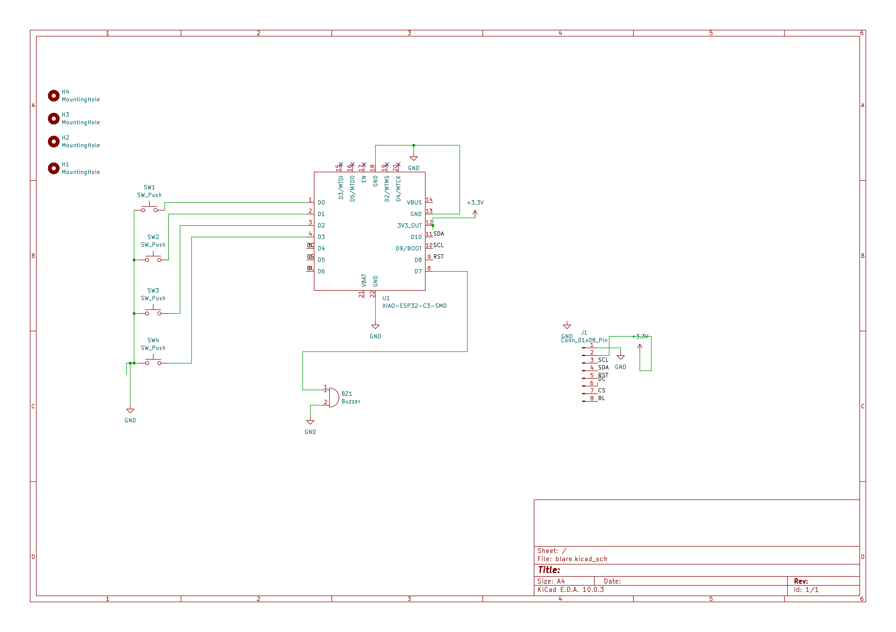
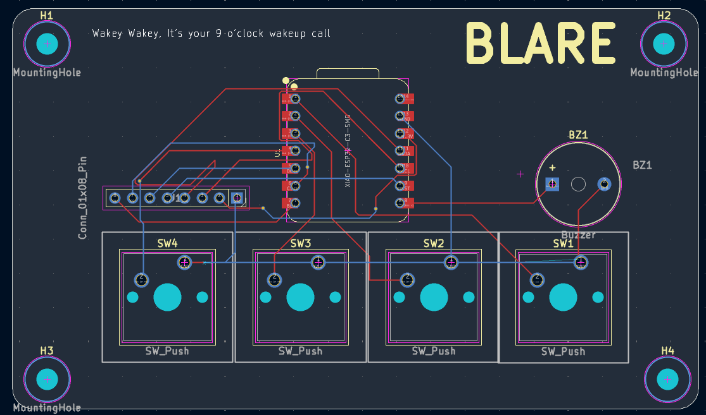
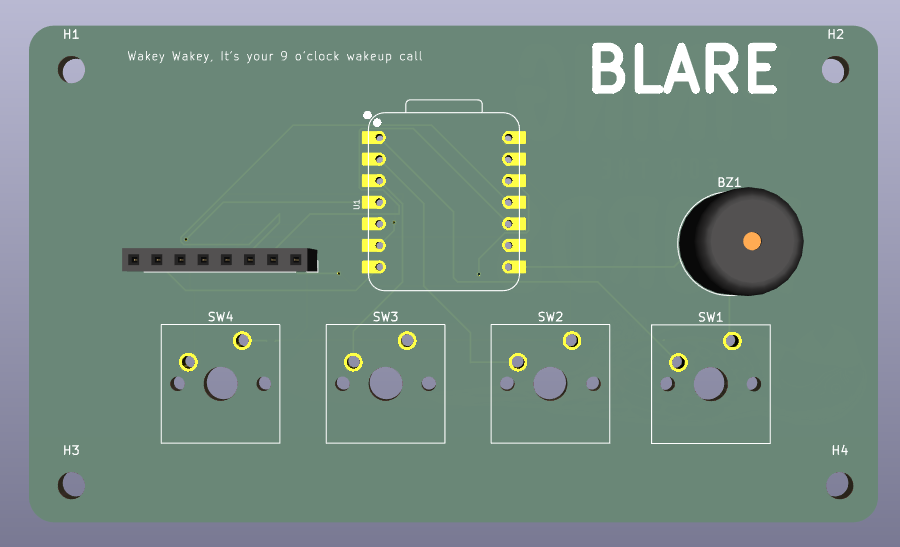
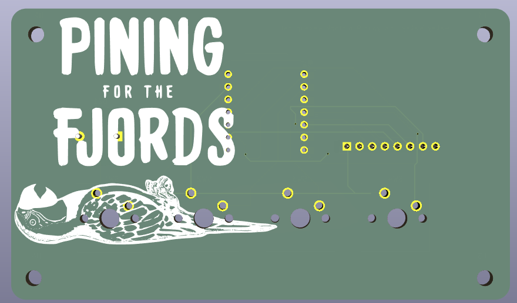
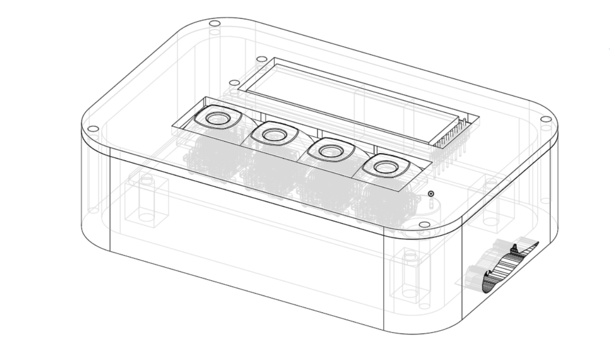

# Blare Alarm Clock
## This is your nine o clock wake up call

An Alarm Clock for the Hack Club Blare YSWS. It contains references to the Monty Python's Flying Circus Dead Parrot Sketch

### Hardware

#### BOM

| Component | Quantity |
| :---      |  :---:   |
| Seeed XIAO ESP32C3 | 1 |
| MX-Style Keyboard Switches | 4 |
| Blank DSA Keycaps | 4 |
| 2.25in TFT Screen | 1 |
|3.3V Piezo Buzzer | 1 |
| 8 Pin Male Header | 1 |
| Female-Female Jumper Wires | 1 | 
| 3D Printed Case | 1 |
| 3D Printed Lid | 1 |
| M3x5x4 Heatset Inserts | 8 |
| M3x8mm Screws | 4 |
| M3x16mm Screws | 4 |

#### PCB

|  |  |
| :---: | :---: |
|  |  |

The PCB is designed and created in KiCad. It uses a:
- Seeed Studio ESP 32 C3
- generic buzzer
- 2.25 in TFT Screen
- 4 keyswitches

#### Case

The case is designed in Onshape it houses all the component with a top for the screen and keyswitches. It has holes for sound and charging